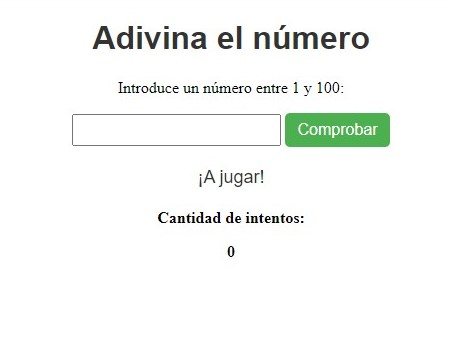

# Juego de Adivinanza

Este repositorio contiene el código de un juego de adivinanza implementado en Javascript. El juego consiste en adivinar un número aleatorio generado por el programa en un rango del 1 al 100. Basado en un tutorial, aprendimos a modificar los estilos desde javascript trayendonos un id, a utilizar el módulo de Math, usando el random, para que nos de un numero randon entre 1 y 100.

### Resultado del proyecto
